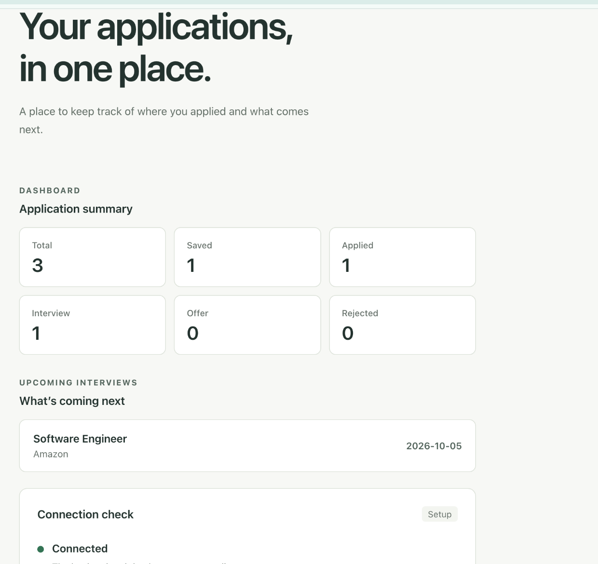
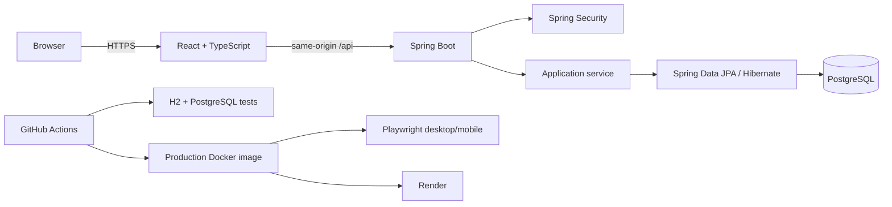

# DevTrack

[](https://github.com/bharath4980/devtrack/actions/workflows/ci.yml)
[](https://devtrack-3upd.onrender.com)

**DevTrack** is a production-deployed job application tracker built with Java 21, Spring Boot, React, TypeScript, and PostgreSQL.

It is designed around the parts of a job search that benefit from reliable software engineering: secure user accounts, owner-scoped data, fast search and filtering, interview tracking, structured validation, automated testing, and a repeatable production deployment.

**[Open the live demo](https://devtrack-3upd.onrender.com)** · **[Engineering notes](docs/engineering.md)** · **[Authentication design](docs/authentication.md)**

> The public demo runs on Render's free tier, so the first request after a period of inactivity can take longer while the service wakes up.

## Preview



## Engineering highlights

- **Secure session authentication** with Spring Security, BCrypt password hashing, CSRF protection, authentication throttling, HttpOnly cookies, and a same-origin content security policy.
- **Per-user data isolation** throughout the application layer and repository queries; users can only read or mutate their own applications.
- **Real application workflows** with create/edit/delete, status tracking, search, filters, pagination, stable sorting, dashboard counts, and upcoming interviews.
- **Reliable API behavior** with server-side validation, structured error responses, field-level frontend feedback, literal wildcard search handling, and stale-request cancellation.
- **Database discipline** with PostgreSQL, Flyway-managed migrations, Hibernate schema validation, and preserved legacy rows during the authentication migration.
- **Production-oriented verification** with H2 and PostgreSQL backend tests, frontend type/build checks, Docker image validation, and Playwright browser workflows on desktop and mobile Chromium.
- **Single-image deployment** where the React production build is served by Spring Boot from a non-root Docker runtime and deployed to Render.

## Architecture



The frontend and API share one origin in production, which keeps the session and CSRF model straightforward. The backend follows a controller/service/repository structure, and every application query is scoped to the authenticated owner.

## Core features

- Register, sign in, and sign out
- Create, edit, and delete job applications
- Track Saved, Applied, Interview, Offer, and Rejected states
- Search by company, title, or location
- Filter by status
- Paginate results and sort by newest, oldest, company, or application date
- Dashboard totals by status
- Upcoming interview tracking
- Per-user application ownership
- Server-side validation and structured API errors
- Authentication throttling and security headers
- PostgreSQL schema management with Flyway
- Responsive desktop/mobile UI

## Tech stack

| Layer | Technologies |
| --- | --- |
| Backend | Java 21, Spring Boot 3, Spring Security, Spring Data JPA, Hibernate, Maven |
| Frontend | React, TypeScript, Vite |
| Database | PostgreSQL, Flyway |
| Testing | JUnit, H2, PostgreSQL integration checks, Playwright |
| DevOps | Docker, Docker Compose, GitHub Actions, Render |

## API example

Applications are returned as an owner-scoped page:

```http
GET /api/applications?search=Acme&status=APPLIED&page=0&size=10&sort=NEWEST
```

```json
{
  "items": [],
  "page": 0,
  "size": 10,
  "totalElements": 0,
  "totalPages": 0
}
```

Search is case-insensitive across company, title, and location. Page size is bounded, sort values are explicit, and wildcard characters such as `%` and `_` are treated as literal text.

## Local setup

### Prerequisites

- Java 21
- Maven
- Node.js 22.12+
- Docker Desktop

### 1. Start PostgreSQL

From the repository root:

```sh
cp -n .env.example .env
docker compose up -d --wait
```

Check the database:

```sh
docker compose ps
```

To stop it:

```sh
docker compose down
```

The PostgreSQL data is stored in a Docker volume. Avoid `docker compose down -v` unless you intentionally want to delete the local database.

If you have data from the older pre-authentication version of DevTrack, see [authentication and ownership](docs/authentication.md#existing-local-databases) before starting the application.

### 2. Run the backend

On macOS, select Java 21 for the current terminal:

```sh
export JAVA_HOME=$(/usr/libexec/java_home -v 21)
```

Then:

```sh
cd backend
mvn spring-boot:run
```

The API runs at `http://localhost:8080`.

Health check:

```text
http://localhost:8080/api/health
```

Expected response:

```json
{"status":"UP"}
```

### 3. Run the frontend

In a second terminal:

```sh
cd frontend
npm ci
npm run dev
```

Open:

```text
http://127.0.0.1:5173
```

Vite proxies local `/api` requests to Spring Boot on port 8080.

## Verification

### Backend

```sh
cd backend
mvn clean test
```

### Frontend

```sh
cd frontend
npm run build
```

GitHub Actions verifies the project in two layers:

1. Runs the backend suite with H2.
2. Re-runs backend tests against a disposable PostgreSQL database, builds the frontend and production Docker image, starts that image, then executes Playwright browser workflows on desktop and mobile Chromium.

The browser suite covers registration/login, CRUD, interview tracking, filters, pagination, validation feedback, persistence after reload, account isolation, and expired sessions.

To run the isolated production browser checks locally:

```sh
docker compose -p devtrack-e2e -f compose.test.yaml up --build -d
cd frontend
npm ci
npx playwright install chromium
npm run test:e2e
cd ..
docker compose -p devtrack-e2e -f compose.test.yaml down
```

The test environment uses port 8081 and a disposable PostgreSQL database. Do not point these tests at the live demo or your normal development database.

## Production deployment

The root `Dockerfile` uses a multi-stage build:

1. Build the React frontend with Node.js.
2. Build the Spring Boot application with Maven and Java 21.
3. Copy the frontend production bundle into Spring Boot's static resources.
4. Run the final application as a non-root user from a Java 21 JRE image.

The deployed service uses:

- `DATABASE_URL`
- `DATABASE_USER`
- `POSTGRES_PASSWORD`
- `SESSION_COOKIE_SECURE=true`
- `PORT=8080`

Secrets stay in the hosting environment and are not committed to the repository. The application supports graceful shutdown and exposes `/api/health` for health checks.

## Design tradeoffs

DevTrack deliberately stays a single-service application instead of adding distributed infrastructure that the current workload does not need.

Current tradeoffs:

- Sessions and authentication throttle counters are in memory and reset on restart.
- Password reset and email verification are not implemented.
- Upcoming interviews use day-level dates and UTC; reminders and time-of-day scheduling are out of scope.
- Search uses relational substring matching instead of a dedicated full-text search service.
- Concurrent edits use last-write-wins.
- Job application entry is currently manual; assisted capture from public job-posting URLs is a possible future product improvement.

For the detailed reasoning behind these choices, see [engineering notes](docs/engineering.md).
